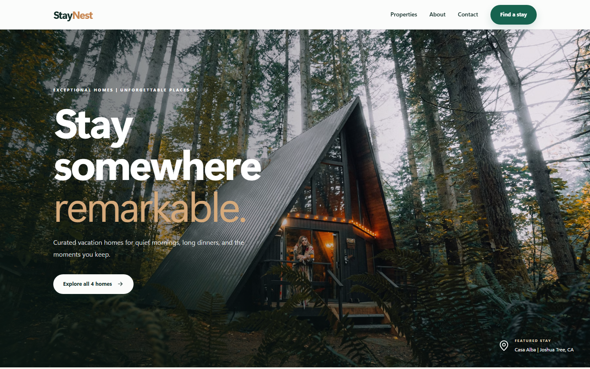
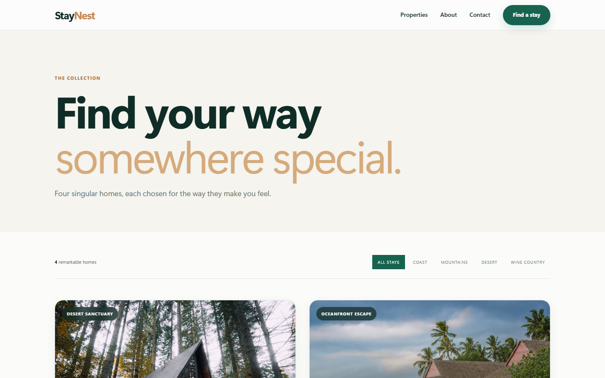
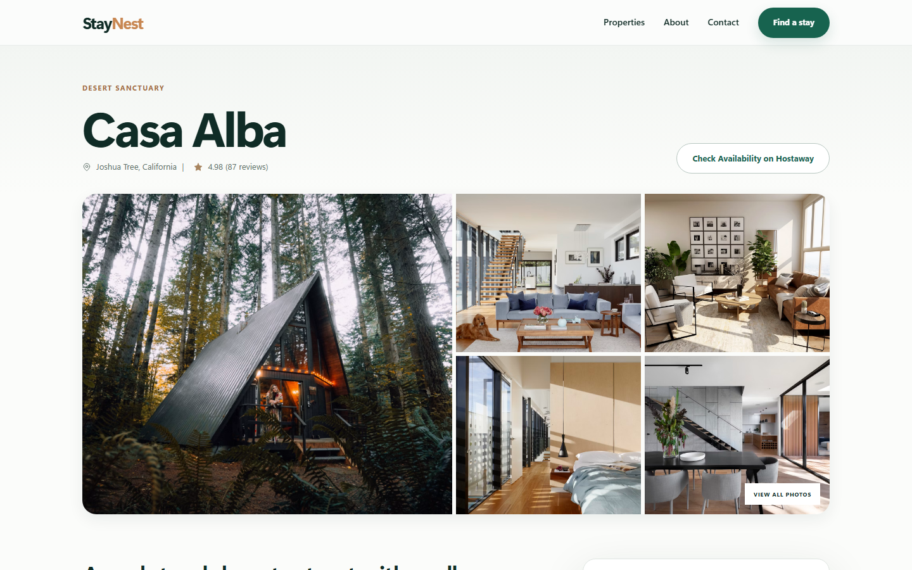
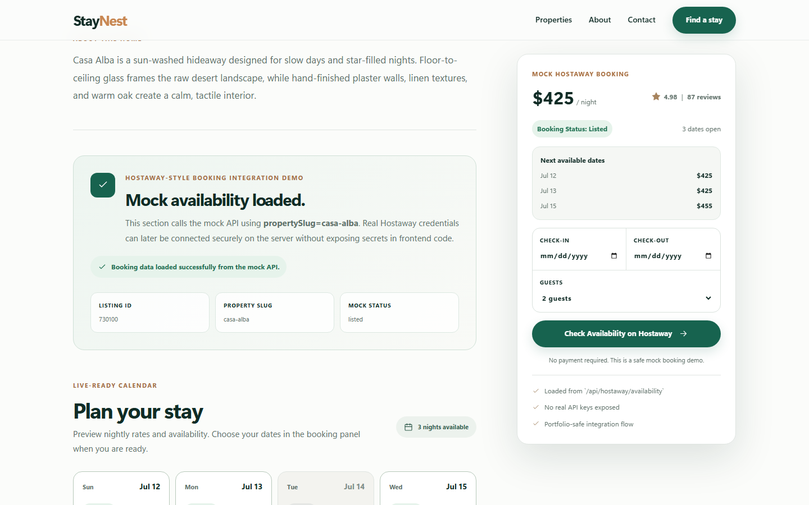
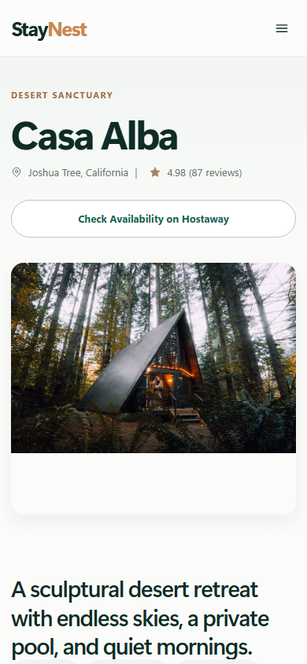

# StayNest Vacation Rental Website

**Live Demo:** [https://staynest-vacation-rental.vercel.app/](https://staynest-vacation-rental.vercel.app/)

StayNest is a modern vacation rental website portfolio demo built to showcase property listings, detailed rental pages, a booking-focused user flow, and a Hostaway-style mock API integration. The project is designed for short-term rental brands, vacation property managers, and hospitality businesses that need a polished direct booking web experience.

## Key Features

- Elegant homepage with luxury travel styling and strong booking CTA
- Property listing page for 4 mock vacation rental homes
- Individual property detail pages with gallery, location, rating, amenities, and guest information
- Booking panel with nightly pricing, booking status, and next available dates
- Hostaway-style mock API integration for listings and availability
- Contact/inquiry form UI
- FAQ and testimonials sections
- Responsive layouts for desktop, tablet, and mobile
- Portfolio screenshot automation with Playwright
- Frontend-safe demo with no real payments, authentication, or exposed API secrets

## Tech Stack

- **Next.js** with App Router
- **TypeScript**
- **React**
- **Tailwind CSS**
- **Next.js API Routes**
- **Playwright** for portfolio screenshot generation
- **Mock data** for rental listings, availability, pricing, and booking URLs

## Pages Included

- `/` - Homepage
- `/properties` - Property listings
- `/properties/casa-alba` - Property detail page
- `/properties/tide-house` - Property detail page
- `/properties/pine-and-peak` - Property detail page
- `/properties/olive-cottage` - Property detail page
- `/about` - About page
- `/contact` - Contact/inquiry page

## Hostaway-Style Mock API Integration

This project includes a safe **Hostaway-style mock API integration** to demonstrate how a vacation rental website can be prepared for live property management data.

The mock API returns structured listing and availability data that resembles the type of data a production rental website might request from a property management platform. The property detail pages use this mock API to show booking status, nightly rates, next available dates, and a simulated booking CTA.

No real Hostaway credentials are included. No API keys are exposed in frontend code. In a production project, real Hostaway credentials, availability endpoints, booking widgets, or direct booking links would be connected securely through server-side environment variables and backend/API routes.

## API Endpoints

### Listings

```text
/api/hostaway/listings
```

Returns all 4 mock vacation rental listings as JSON.

### Availability

```text
/api/hostaway/availability?propertySlug=casa-alba
```

Returns mock listing and availability data for Casa Alba.

The availability API also supports mock lookup patterns such as numeric property IDs and listing IDs for demonstration purposes.

## Screenshots

### Homepage



### Property Listings



### Property Detail Page



### Booking / API Integration Section



### Mobile Responsive View



## How to Run Locally

Install dependencies:

```bash
npm install
```

Start the development server:

```bash
npm run dev
```

Create a production build:

```bash
npm run build
```

Optional: generate portfolio screenshots:

```bash
npm run screenshots
```

## Portfolio Note

StayNest is a portfolio demonstration project. It uses mock vacation rental data and a Hostaway-style mock API integration to show how a real rental website could display listings, pricing, availability, and booking CTAs.

This is not a live Hostaway production integration. A production version can be connected to real Hostaway credentials, live availability, booking widgets, and secure server-side endpoints based on the client’s requirements.
